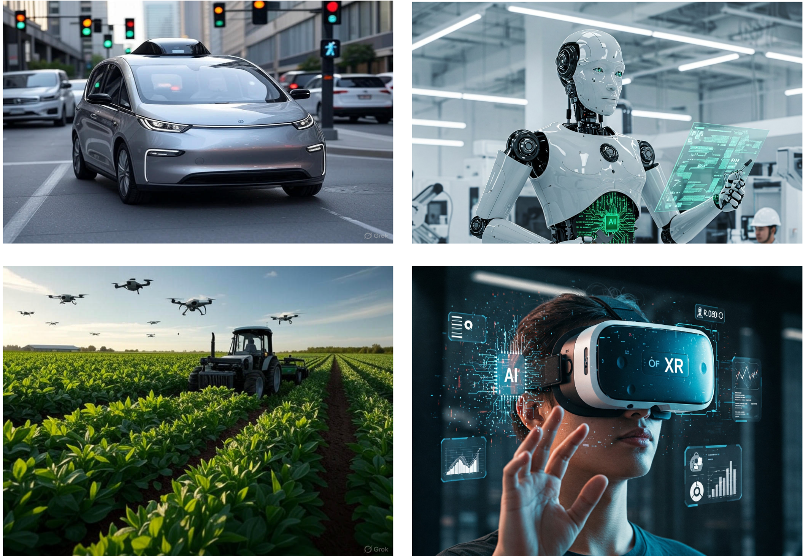

# Physical Intelligence Initiative (PI²) Workshop
<!--  -->

[Theme](#theme) | [Agenda](#agenda) | [Invited Speakers](#invited-speakers) | [Travel & Accommodations](#travel--accommodations) | [Register (FREE)](#join-the-conversation) | [Contact Us](#contact-us)

---

*Bridging the gap between digital computation and the physical world through robotics, and artificial intelligence.*

Physical AI represents a groundbreaking frontier where artificial intelligence (AI) integrates with physical systems to interact with and manipulate the real world. This cutting-edge technology drives transformative advancements in robotics, automation, and human-machine collaboration. It powers innovative solutions across diverse sectors, from humanoid robots addressing labor shortages to autonomous systems bolstering defense capabilities. By enabling machines to perceive, reason, and act, physical AI sets new standards for efficiency and adaptability in environments like warehouses and off-road autonomous driving. As it evolves, physical AI is poised to revolutionize industries and redefine human-technology interactions. 

**Date:** November 6-7, 2025

**Location:** University of Delaware, Newark, DE

---

## Theme

*Advancing Physical Intelligence for Human-Centered Mobility through Robotics, AI, and Autonomous Systems.*

This workshop will explore how to create autonomous systems that can safely and effectively navigate the physical world.
We will focus on the core abilities of physical intelligence for mobility.

---

## ✅ **Agenda (Tentative)**

A dynamic program designed to foster collaboration and spark innovation.

* *Academic Keynotes and Industry Panels:* Engage with leaders from industry and academia shaping the future of phyiscal AI.
* *Lightning Talks and Research Posters:* Discover cutting-edge academic research in fast presentations and interactive sessions.

#### 📅 **Day 1: November 6 (Full Day)**

| Time             | Session                                                                  |
| ---------------- | ------------------------------------------------------------------------ |
| 8:30 – 9:00 AM   | Registration & Breakfast                                                 |
| 9:00 – 9:15 AM   | Opening Remarks – Welcome from University Leadership: *Pamela Norris*, Dean of College of Engineering|
| 9:15 – 10:00 AM   | Keynote 1: From Intentions to Policies: Marrying Classical Robotics with Foundation Models in the Wild (by [Gregory Dudek](https://cim.mcgill.ca/~dudek/)) 
 Abstract: Robots are finally good enough to fail for interesting reasons. Turning them into reliable physical intelligence demands fusing foundation models (FMs) with the planning, control, and verification tools robotics already trusts. I will present a three-level FM architecture deployed across marine robotics and telecommunications: (1) Program — use vision-language-action models to specify tasks and synthesize mission graphs that compile to classical planners (TAMP/MPC) under explicit safety constraints; (2) Monitor — run lightweight FM probes for anomaly explanation and policy-level “guardrails,” coupled to state estimators and runtime monitors; (3) Infer — apply multimodal FMs to the data stream (video/sonar/RF) for labeling, novelty detection, and mission replanning. I’ll show example from marine missions and RL-for-telecom energy optimization, including policy-distillation into control primitives, improvements in flexibility and deployment cost, and measurable energy savings. The argument is not “replace planning with LLMs,” but compose them: classical methods provide liveness or guarantees, FMs provide semantic reach. I’ll end with some thoughts on safety and performance guarantees, and what I feel are emerging challenges to our community.
 |
| 10:00 – 11:00 AM  | Industry Panel I: XR & AI (Session Chair: Chuchu Chen)|
| 11:00 – 11:15 AM | Break                                                                    |
| 11:15 – 12:15 PM | Academic Lightning Talks                                             |
| 12:15 – 1:00 PM  | Networking Lunch                                                         |
| 1:00 – 1:45 PM   | Keynote 2:  The Next Thought: How The Coming Data Wave Will Reshape The Operating Room (by Michael Karch)|
| 1:45 – 2:45 PM   | Industry Panel II: Robotics & Autonomous Vehicles (Session Chair: Yixiang Deng)|
| 2:45 – 3:00 PM   | Break                                                                    |
| 3:00 – 3:45 PM   | Keynote 3:   The Promise of Procedural Synthetic Data and Environments  (by [Jia Deng](https://www.cs.princeton.edu/~jiadeng/)) 
 Abstract: Data, especially large-scale labeled data, has been a critical driver of progress in AI. However, many important tasks remain starved of high-quality data. Synthetic data from computer graphics is a promising solution to this challenge, but still remains in limited use. This talk will present our work on Infinigen, a procedural generator designed to create unlimited high-quality 3D environments for computer vision and robotics. Infinigen is entirely procedural: every asset, from shape to texture, is generated from scratch via randomized mathematical rules. I will present how we constructed Infinigen, and our recent works on various extensions and applications. 
            |
| 3:45 – 5:00 PM   | Research Posters                        |
| 5:00 – 6:00 PM   | Lab Tour                                              |
| 6:00 – 7:30 PM   | Networking Dinner                                                     |

#### 📅 **Day 2: November 7 (Half Day)**

| Time             | Session                                                              |
| ---------------- | -------------------------------------------------------------------- |
| 8:30 – 9:00 AM   | Breakfast & Networking                                               |
| 9:00 – 9:45 AM   | Keynote 4:    Verifiable Autonomy: The Path to Robust Physical AI (by Shubham Shrivastava)       |
| 9:45 – 10:00 AM  | Industry-University Collaboration Mechanisms (Session Chair: Weisong Shi) |
| 10:00 – 10:15 AM | Break                                                                |
| 10:15 – 11:45 AM | Collaboration Idealization    (Session Chair: Paul Huang)            |
| 11:45 – 12:00 PM | Closing Remarks – Next Steps for PI2                                 |

---

## Invited Keynote Speakers

Hear from pioneers shaping the future of physical intelligence.

| Name | Title | Affiliation |
|:-------------|:--------------|:--------------|
| Gregory Dudek |  Professor  | McGill University |
| Jia Deng |  Professor  | Princeton  University |
| Michael Karch  |  Orthopaedic Surgeon and AI in Healthcare Specialist  | M. Karch M.D., Inc|
| Shubham Shrivastava  |  Head of AI  | Kodiak |

---

## Travel & Accommodations

### Getting Here

*By Air:* The University of Delaware is accessible from two major international airports:
* *Philadelphia International Airport (PHL):* The closest airport, approximately a 40-minute drive to campus.
* *Baltimore/Washington International Thurgood Marshall Airport (BWI):* Approximately a 75-minute drive to campus.

*Ground Transportation:* From either airport, you can reach Newark via:
* Rental Car
* Ride-sharing services (Uber, Lyft)
* Amtrak and SEPTA regional rail services (the Newark, DE station is located on campus).

### Where to Stay

There are several hotels conveniently located near the University of Delaware campus.
You can find a list of local hotels through [Campus Travel](https://campustravel.com/university/university-of-delaware/).
We would recommend booking ahead of time. Unfortunately, we cannot guarantee the availability of any hotel rooms.

---

## Join the Conversation

Register now to secure your spot at the PI² Workshop and connect with leaders and innovators in the field.

[**Register Now**](https://udel.ungerboeck.net/prod/emc00/register.aspx?aat=45715937454c4f424a6a47625a4e6d5667426c77726b71533333304b5759616e47395a784c4244336c51453d) **[FREE]**

---

## Contact Us

**PI2 Organizing Committee:**
* [Yixiang Deng](https://yixiangd.github.io/)
* [Guoquan Huang](https://udel.edu/~ghuang/)
* [Weisong Shi](https://www.weisongshi.org/) 

Email: [pi2workshop@udel.edu](mailto:pi2workshop@udel.edu)

---

© 2025 PI² Workshop. All Rights Reserved.
